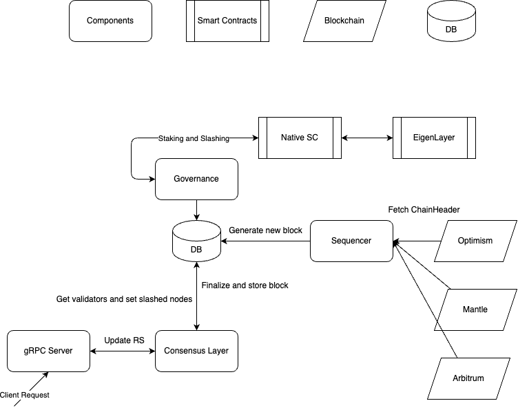

# Lagrange Node

This is the Lagrange Node, a node that can be used to run a Lagrange network.

## Table of Contents

- [Architecture](#architecture)
- [Installation](#installation)
- [Usage](#usage)
- [License](#license)

## Architecture

The Lagrange Node consists of the following components:

- Sequencer
- Synchronizer
- gRPC Sequencer Server
- gRPC Client Node

Here is the diagram of the architecture:

<p align="center">
  
</p>

## Installation

### Prerequisites

This project is written in Go 1.21. You can download it from [here](https://golang.org/dl/).

### Build

To build the project, run the following command:

```bash
make build
```

This will create a binary called `lagrange-node` in the `dist` directory.

## Usage

- To run the sequencer, run the following command:

  ```bash
  ./dist/lagrange-node run-sequencer -c <config-file>
  ```

- To run the gRPC sequencer server, run the following command:

  ```bash
  ./dist/lagrange-node run-server -c <config-file>
  ```

- To join a network and run the client node, run the following command:

  ```bash
  ./dist/lagrange-node run-client -c <config-file>
  ```

### Migration Tool

The migration tool is used to migrate the database schema. To run the migration tool, run the following command:

```bash
go run ./cmd/migrate/... up/down -u <database_url> -s <step>
```

### Test & Useful Commands

Here are the commands to run the tests:

```bash
# Run unit-tests
make test
```

```bash
# Run the local network
make localnet-start
```

```bash
# Stop the local network
make stop
```

```bash
# Generate the protobuf files
make proto-gen
```

```bash
# Build the docker image
make docker-build
```

```bash
# Install linter
make install-linter
```

```bash
# Lint the codebase
make lint
```

## License

This project is licensed under the [XXXX](./LICENSE).

[⬆️ Back to Top](#table-of-contents)
