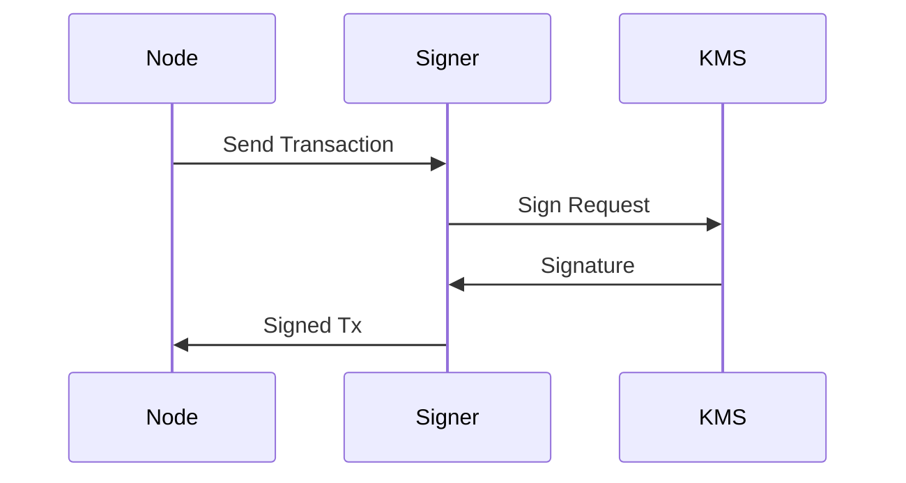

## Signer

This is a simple signer daemon that listens for incoming requests to sign data. It is intended to integrate with sevral KMS providers, such as AWS KMS, Local KMS, etc. It also supports multiple accounts by differentiating the requests by the `request_id` field. The signer daemon is a gRPC server secured with TLS.

